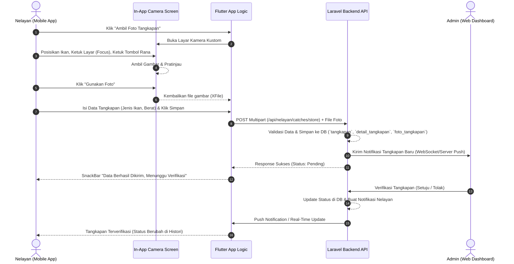
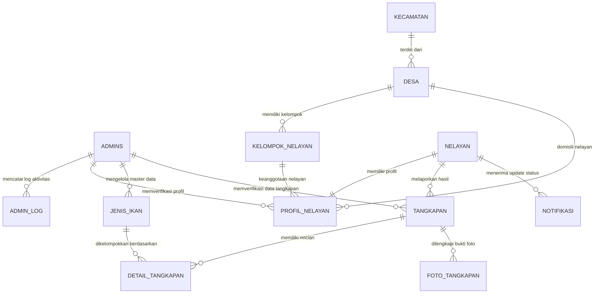

# Dokumentasi Sistem Aplikasi SITANGKAP
## (Sistem Informasi Pencatatan Hasil Tangkapan Nelayan Cilacap)

Dokumen ini menyediakan panduan arsitektur teknis lengkap, penjelasan stack teknologi, alur data (flowchart), perancangan database (ERD), serta dokumentasi fitur untuk aplikasi **SITANGKAP** (Website Admin & Mobile App Nelayan).

---

## 1. Ringkasan Eksekutif & Stack Teknologi

SITANGKAP adalah platform digital terintegrasi yang dirancang untuk membantu Dinas Kelautan dan kelompok nelayan di Kabupaten Cilacap dalam mendata hasil tangkapan ikan secara akurat dan dinamis. Sistem ini mempermudah pelaporan tangkapan oleh nelayan secara langsung dari laut (melalui Mobile App) dan memudahkan verifikasi data serta pelaporan administratif (melalui Web Portal).

### 🛠️ Stack Teknologi yang Digunakan

| Komponen | Teknologi | Deskripsi |
| :--- | :--- | :--- |
| **Backend API** | **Laravel 11 (PHP 8.3)** | Berperan sebagai pusat logika bisnis, otentikasi token JWT/Sanctum, manajemen RESTful API, audit logging, server-side validation, dan penyimpanan file foto tangkapan. |
| **Frontend Web Admin**| **Blade Templating + Tailwind/CSS + Vite** | Dashboard admin dinamis untuk verifikasi data nelayan baru, persetujuan hasil tangkapan, audit logs, ekspor laporan, dan grafik statistik. |
| **Mobile App (Nelayan)**| **Flutter 3 (Dart 3)** | Aplikasi cross-platform Android & iOS dengan antarmuka premium, state management *Provider*, in-app custom camera, integrasi WebSockets, dan penyimpanan offline lokal (*SharedPreferences*). |
| **Database** | **MySQL / MariaDB** | Database relasional untuk menyimpan data geospasial (lat/long), relasi entitas, logs audit, riwayat verifikasi, dan master data wilayah. |
| **Real-time Engine** | **WebSockets (Socket.io / WS)** | Komunikasi dua arah instan untuk notifikasi verifikasi tangkapan baru kepada admin, dan pembaruan status verifikasi langsung kepada nelayan. |

---

## 2. Alur Kerja Sistem (Flowchart)

Berikut adalah diagram alur (Sequence Diagram) yang menggambarkan proses dari nelayan melaut, mengambil foto menggunakan modul kamera in-app baru, hingga admin memverifikasi data tangkapan di web dashboard.

---

## 3. Desain Database & Entity Relationship Diagram (ERD)

Database `tangkapan_cilacap` dirancang dengan arsitektur relasional yang ketat, mengoptimalkan integritas referensial menggunakan *Foreign Key* dan UUID/Char(36) sebagai kunci utama untuk meningkatkan keamanan dan fleksibilitas sinkronisasi data offline.

### 📊 Entity Relationship Diagram (ERD)

### 🗄️ Kamus Data & Skema Tabel Utama

#### A. Tabel `nelayan`
Menyimpan akun kredensial dasar nelayan untuk autentikasi sistem mobile.
* `id` (Char(36), PK): UUID unik.
* `nama_lengkap` (Varchar(255)): Nama lengkap nelayan.
* `email` (Varchar(255), Unique): Alamat email untuk login.
* `password` (Varchar(255)): Hash sandi bcrypt.
* `no_telepon` (Varchar(255)): Nomor kontak aktif.
* `tempat_lahir` / `tanggal_lahir`: Data tempat & tanggal lahir nelayan.
* `status_akun` (Enum('active', 'suspended', 'inactive')): Status keaktifan akun.

#### B. Tabel `profil_nelayan`
Berisi detail kepemilikan kapal, kelompok, verifikasi administratif, dan KTP.
* `id` (Char(36), PK): UUID unik.
* `nelayan_id` (Char(36), FK): Relasi ke tabel `nelayan`.
* `kelompok_id` (Char(36), FK): Relasi ke tabel `kelompok_nelayan`.
* `desa_id` (Char(36), FK): Relasi domisili ke tabel `desa`.
* `jenis_kapal` (Varchar(255)): Tipe perahu (misal: Jukung, Katir).
* `no_registrasi_kapal` (Varchar(255)): Nomor register lambung kapal.
* `status_verifikasi` (Enum('pending', 'verified', 'rejected')): Status kelayakan.
* `admin_id` (Char(36), FK): Admin yang memverifikasi akun ini.

#### C. Tabel `tangkapan`
Data header utama setiap pelaporan melaut yang dikirim oleh nelayan.
* `id` (Char(36), PK): UUID unik.
* `nelayan_id` (Char(36), FK): Pelapor tangkapan (tabel `nelayan`).
* `tanggal_penangkapan` (Date): Waktu nelayan mendarat/melaut.
* `lokasi_nama` / `latitude` / `longitude` (Decimal): Geotagging area penangkapan.
* `status` (Enum('pending', 'verified', 'rejected')): Status verifikasi laporan tangkapan.
* `admin_id` (Char(36), FK): Petugas dinas kelautan yang memverifikasi.

#### D. Tabel `detail_tangkapan`
Data baris berisi berat dan spesies ikan per laporan.
* `id` (Char(36), PK): UUID unik.
* `tangkapan_id` (Char(36), FK): Relasi ke tabel `tangkapan`.
* `jenis_ikan_id` (Char(36), FK): Jenis spesies (tabel `jenis_ikan`).
* `berat_kg` (Decimal(10,2)): Berat total tangkapan dalam kilogram.
* `jumlah_ekor` (Int): Jumlah estimasi (opsional).

#### E. Tabel `foto_tangkapan`
Menyimpan path file fisik foto bukti tangkapan yang diambil dari kamera.
* `id` (Char(36), PK): UUID unik.
* `tangkapan_id` (Char(36), FK): Relasi ke tabel `tangkapan`.
* `file_path` (Varchar(255)): Direktori penyimpanan foto di server.
* `file_name` (Varchar(255)): Nama file acak untuk mencegah duplikasi.

---

## 4. Fitur Utama & Fungsionalitas Aplikasi

### 📱 Fungsionalitas Mobile App (Nelayan)

1. **Autentikasi Aman & Profiling**:
   - Pendaftaran menggunakan data kelompok nelayan resmi dan verifikasi KTP.
   - Login menggunakan token JWT with local session cache.
2. **Kamera In-App Premium (Fitur Kustom Baru)**:
   - **Real Camera Stream**: Menggunakan lensa kamera perangkat secara langsung untuk mencegah manipulasi foto galeri pihak ketiga.
   - **Focus Ring & Exposure**: Ketuk area layar mana pun untuk fokus visual instan pada objek ikan.
   - **Grid Line Overlay (3x3)**: Panduan estetika untuk menyeimbangkan posisi pengambilan foto.
   - **Blue Frame Guide**: Panduan bingkai khusus di layar untuk memastikan ikan terpusat di posisi landscape.
   - **Flash Modes**: Opsi menyalakan blitz otomatis (*Auto*), manual (*On*/*Off*), atau lampu senter (*Torch*).
   - **Review State**: Layar pratinjau sebelum menyimpan data, memberikan opsi *Ambil Ulang* atau *Gunakan Foto*.
3. **Pencatatan Mandiri**:
   - Pemilihan tanggal mendarat dan jenis ikan utama berdasarkan master data.
   - Form input berat dengan validasi format desimal.
4. **Riwayat & Notifikasi**:
   - List transaksi tangkapan dengan badge warna status dinamis (Kuning = Pending, Hijau = Terverifikasi, Merah = Ditolak).
   - Notifikasi real-time jika data tangkapan disetujui atau ditolak oleh Admin Dinas Kelautan.

### 💻 Fungsionalitas Web Portal (Admin Dinas)

1. **Dashboard Statistik**:
   - Grafik total berat tangkapan per jenis ikan (Tuna, Cakalang, Tongkol, dll.) secara real-time.
   - Summary total nelayan aktif dan data pending verifikasi.
2. **Verifikasi Pendaftaran Nelayan Baru**:
   - Tinjauan berkas registrasi, data kapal, domisili, dan foto KTP nelayan.
   - Tindakan persetujuan (approve) untuk memberikan akses nelayan mengirim data.
3. **Verifikasi Bukti Tangkapan**:
   - Validasi kecocokan spesies ikan pada foto bukti tangkapan dengan data berat yang diinput oleh nelayan.
   - Kolom catatan verifikasi jika tangkapan ditolak (misal: "Foto buram/tidak sesuai").
4. **Audit Audit & Keamanan (Admin Logs)**:
   - Log pelacakan menyeluruh untuk merekam aktivitas login, verifikasi nelayan, verifikasi tangkapan, dan perubahan data master beserta alamat IP.
